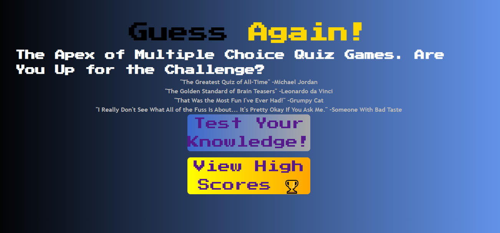
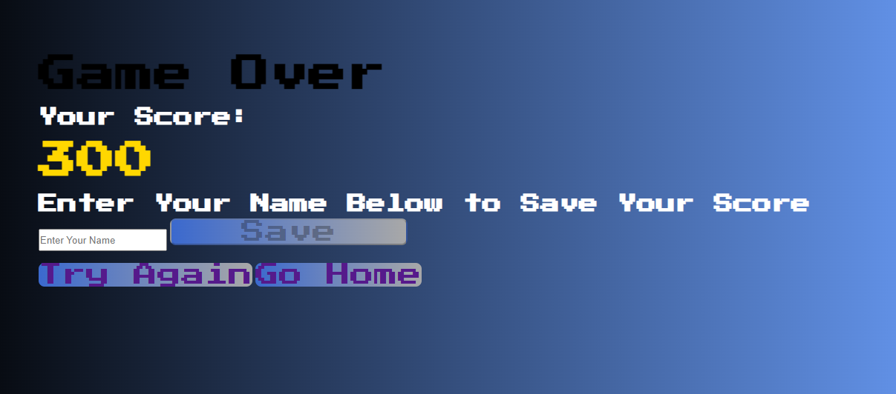
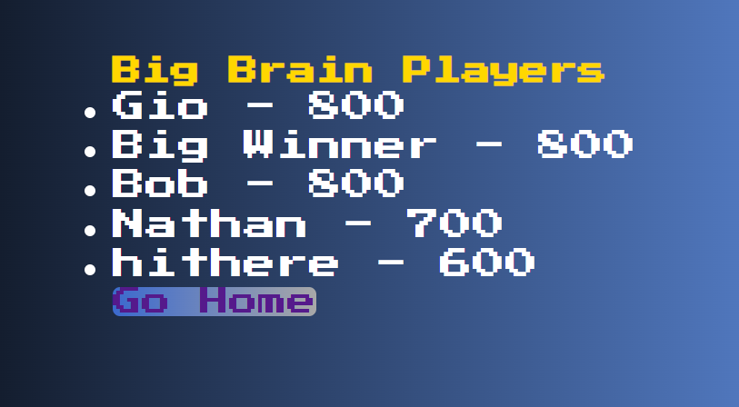

# NBM-Homework-04-Code-Quiz
MY USER STORY 

AS AN aspiring software engineer and coding boot camp student

I WANT to develop a quiz with a set timer using effective JavaScript fundamentals that provides users with quiz scores based on their performance that will be listed on a high score sheet

SO THAT I can showcase my understanding of JavaScript fundamentals while also challenging my peers to fun brain teasers

SUPPLIED USER STORY

AS A coding boot camp student

I WANT to take a timed quiz on JavaScript fundamentals that stores high scores

SO THAT I can gauge my progress compared to my peers

I began this process by updating my instructor-supplied placeholder questions with questions of my own, then added another four questions to increase the length and challenge of the quiz.

Next I created as many of the relevant css,html, and js pages as I thought were needed to link between each page when starting the game, answering questions, inputing username info for the leaderboards page, and leaderboards page.

After this, I decided to implement some css styling to keep the same general color pallete as my portfolio website to maintain a consistent them when visiting my main page.

To give the quiz more pizzaz, I decided to add some extra colors to my usual monochrome x cornflower blue colorway with the use of gold and red accents for scores, correct answers and incorrect answers.

Another design choice I made late in the coding process was to use the Press Start 2P font that I aqquired from Google Fonts to give it an 8bit retro-video game style as some of the questions featured trivia about old video games and esports facts.

There were some design and game functionality elements that I would have liked to have implemented but was unable to do given the time between assignments, but I would like to return to this project to impliment these changes later.

Some of the design elements included a favicon, highlighting the correct answer when a wrong answer is selected, and having the wrong answer move/jiggle when selected.

A gameplay element I would like to impliment would be to have the score deduct 50 points for each incorrect answer, to make this fair and still attainable to reach the high score leaderboards, I plan on increasing the total question count from 8 to 20.

Another gameplay element I would like to include later would be to have a special design/prompt display when the player reaches the highest score possible after completing the quiz and selecting all of the correct answers.

Side Note: I am currently a part of the team that trains new hires at my place of work, and am now considering making another version of this quiz designed around our companies aesthetic and using questions we expect new hires to know the answers to by the end of their first and second week of training.

Quiz Home Page

Quiz While Running

The javascript sections of this assignment proved to be the most challenging as I struggled to impliment some of the concepts taught in class in a way that would make the game function as I envisioned. 

My original approach was to have the game exist exclusively on one html sheet that would reference two separate js sheets for questions and the quiz. I ended up spending about six hours researching and viewing tutorial videos on how to build a incrementing score multiple choice quiz. From the various videos that I had watched, the ones that made the most sense to me kept the questions and quiz code on one js sheet. 

Though the videos were helpful, I didn't want to restrict myself to using one format and instead used elements and concepts from about four different tutorials to build a structure that I was content with. In addition to this, none of the videos featured a timer element that ticked down with each second. So I needed to do more research into building a countdown timer that worked with the game while also decrementing the time remaining with each incorrect guess.

One of the biggest hurdles for me was getting the timer to work when the game starts. When I got the timer function to begin counting down, I noticed that the timer would begin when the page loaded. After some troubleshooting I was able to make the timer work when the "Test Your Knowledge" *Start Game* button was pressed. This was the first key that made me want to switch to using multiple pages for the home page, quiz page, score input page, and leaderboards page. When the timer started with the full "game-home-page" class being displayed, the page began to look cluttered and I had yet to implement the questionaire itself.

Next, I noticed that the game would only move to the score input screen when there were no more questions left to answer and not when the timer hit zero. 

I created an endGame function that would only activate when the timer hit a second increment of less than or equal to zero, which would direct the user to the score input page regardless of how many questions were answered.

Score Input Page

High Score Page

Side Note: This is silly but I figured I would explain some context behind the user hithere on the leaderboards page. I had my roommate try my quiz and he decided to use hithere as his leaderboard user name. I initially read it as "Hit Here" but after speaking with him, he confirmed that it was supposed to read "Hi There." Just a prime example of how messages via text can be misinterpretted. 

[DeployedCodeQuizApplication](https://nathanmilburn.github.io/NBM-Homework-04-Code-Quiz/)
[DeployedCodeQuizRepository](https://github.com/NathanMilburn/NBM-Homework-04-Code-Quiz.git)
